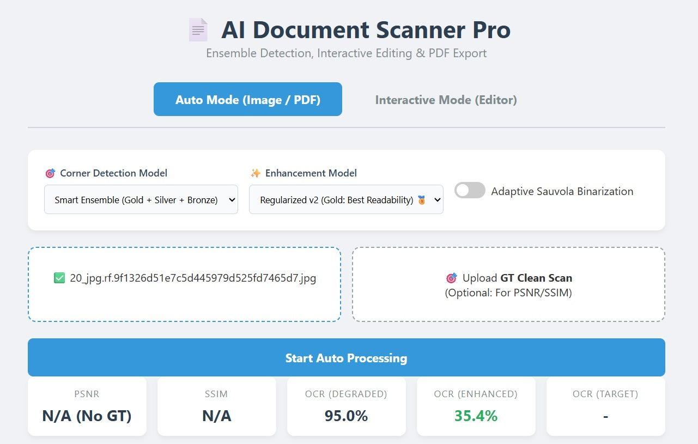
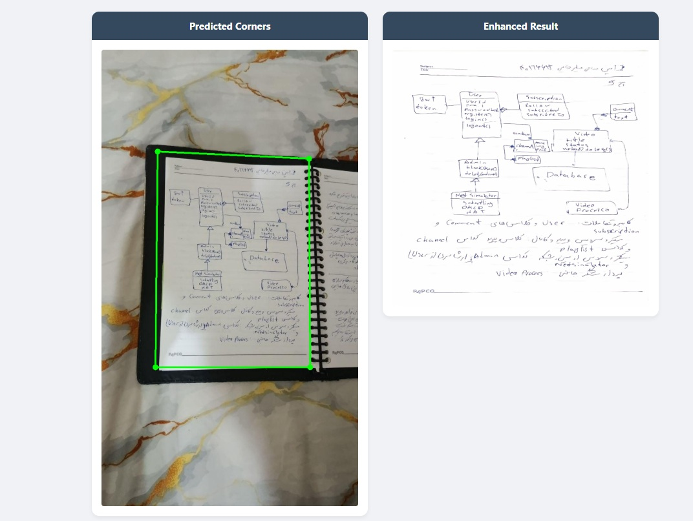
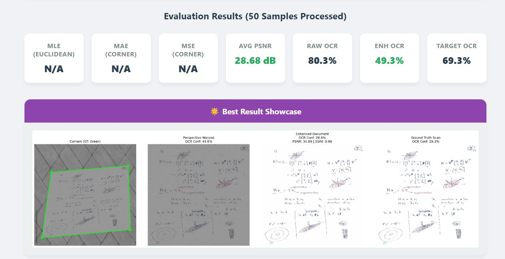

# AI Document Scanner Pro

[](https://www.python.org/downloads/)
[](https://pytorch.org/)
[](https://fastapi.tiangolo.com/)
[](https://opensource.org/licenses/MIT)

## Abstract
This repository presents a comprehensive deep learning pipeline engineered for the automatic rectification and photometric restoration of document images captured via unconstrained smartphone cameras. The system integrates advanced spatial localization networks (Corner Detection) with a U-Net-based image restoration architecture (Enhancement). By leveraging a zero-annotation synthetic data generation pipeline, the models are trained to be robust against complex, real-world photometric and geometric distortions, effectively transforming degraded inputs into high-fidelity, mathematically restored document scans.

---

## 🌟 Key Methodological Features

- **Sub-Pixel Corner Localization**: Utilizes heatmap regression coupled with a differentiable SoftArgmax layer and scheduled bottleneck regularization for precise geometric prediction.
- **Projective Smart Ensemble 3.0**: Incorporates projective geometry heuristics, convexity constraints, and physical symmetry rules to aggressively filter and aggregate predictions, preventing reward hacking during corner localization.
- **Out-Of-Distribution (OOD) Gatekeepers**: Employs statistical border variance and histogram distribution analysis to dynamically bypass the enhancement phase for pre-cropped or natively digital scans.
- **Differentiable Perspective Correction**: Integrates GPU-accelerated differentiable warping (via Kornia) to maintain natural aspect ratios utilizing Euclidean bounds.
- **Zero-Annotation Synthetic Generation Pipeline**: A purely data-driven augmentation engine simulating 10+ complex real-world degradations, including 3D non-linear paper curl (Elastic Transform), cylindrical open-book warping, and localized illumination gradients.

---

## 🖥️ System Interface & Visualization

The project features a production-ready FastAPI backend paired with an interactive HTML5 canvas, designed to demonstrate the pipeline's capabilities in both automated and manual modes, alongside a comprehensive evaluation suite.

### Production UI & Architecture Selection
The interface provides granular control over the inference pipeline, allowing the selection of specialized models based on the required trade-off between geometric mathematical fidelity and semantic human readability.



### Automated Pipeline (Inference)
In Auto Mode, the system independently executes the full differentiable chain: identifying document boundaries, executing perspective transformation, and applying the restorative U-Net model.



### Interactive Editor Mode
The Interactive Mode introduces a human-in-the-loop paradigm, enabling users to manually refine predicted corners via an interactive canvas before applying the non-linear photometric enhancement.


### Comprehensive Evaluation Dashboard
A dedicated evaluation dashboard facilitates batch processing and rigorous benchmarking across mathematical (PSNR, SSIM, MLE) and functional OCR metrics, dynamically showcasing the optimal results.



---

## 📋 Table of Contents

1. [Installation](#-installation)
2. [Data Preparation](#-data-preparation)
3. [Usage: Inference & Demo](#-usage-inference--demo)
4. [Usage: Unified Evaluation](#-usage-unified-evaluation)
5. [Usage: Training](#-usage-training)
6. [Model Zoo & Benchmarks](#-model-zoo--benchmarks)
7. [Project Structure](#-project-structure)

---

## 🔧 Installation

### Prerequisites
- Python 3.8 or higher
- CUDA-compatible GPU (Highly recommended)

### Step 1: Clone Repository
```bash
git clone [https://github.com/mahajialirezaei/CNN-Applications-Doc-Scanning-And-Enhancement.git](https://github.com/mahajialirezaei/CNN-Applications-Doc-Scanning-And-Enhancement.git)
cd CNN-Applications-Doc-Scanning-And-Enhancement

```

### Step 2: Install Dependencies

```bash
pip install -r requirements.txt

```

*(Ensure `kornia`, `fastapi`, `uvicorn`, `PyMuPDF (fitz)`, and `pytesseract` are installed for full functionality).*

---

## 📊 Data Preparation

Organize your data exactly as follows. The training pipeline relies strictly on `clean_scans` and `random_backgrounds` to generate synthetic pairs on-the-fly. The `raw` directory is explicitly reserved for evaluation.

```text
data/
├── clean_scans/             # 50 Clean target scans (1.jpg to 50.jpg)
├── random_backgrounds/      # Background images (tables, carpets, floors)
└── raw/
    ├── real_photos/         # 23 Real smartphone photos
    │   └── _annotations.coco.json  # Ground-truth corners for evaluation
    └── real_photos_scanned/ # 23 Reference CamScanner targets (for OCR benchmarks)

```

---

## 🚀 Usage: Inference & Demo

The `demo.py` script is the primary entry point for testing the pipeline on new, unseen images. It explicitly requires paths to the model checkpoints.

### Single Image Demo (Visualization)

Process a single real-world photo and generate a side-by-side comparison:

```bash
python demo.py \
    -i data/raw/real_photos/1_jpg.rf.40baed1b840a2eacea27fac3c3e26884.jpg \
    -o outputs/results/ \
    --enhancement-model checkpoints/enhancement_regularized_v2/best_model.pth \
    --corner-model checkpoints/corner_heatmap_regularized_v4/best_model.pth \
    --corner-approach heatmap \
    --visualize

```

### Batch Processing

Process an entire directory of photos automatically:

```bash
python demo.py \
    -i data/raw/real_photos/ \
    -o outputs/results/ \
    --enhancement-model checkpoints/enhancement_regularized_v2/best_model.pth \
    --corner-model checkpoints/corner_heatmap_regularized_v4/best_model.pth \
    --corner-approach heatmap \
    --batch

```

---

## 📈 Usage: Unified Evaluation

The `evaluate.py` script is designed to run rigorous benchmarks on all models. You can evaluate models on `synthetic` data (measuring PSNR, SSIM, and geometric localization errors) or `real` data (measuring Optical Character Recognition (OCR) confidence and real-world geometric accuracy).

Below is the complete reference of commands required to evaluate **every iteration** of the models in the registry.

### 1. Evaluating Pure Enhancement Models (Using Ground Truth Corners)

To isolate the performance of the U-Net models without the influence of corner prediction errors, use the `--use-gt-corners` flag.

**Enhancement Clean Nodropout (v1 & v2):**

```bash
# Synthetic Data (PSNR / SSIM)
python evaluate.py --dataset-type synthetic --use-gt-corners --enhancement-ckpt checkpoints/enhancement_clean_nodropout/best_model.pth
python evaluate.py --dataset-type synthetic --use-gt-corners --enhancement-ckpt checkpoints/enhancement_clean_nodropout_v2/best_model.pth

# Real Data (OCR Confidence)
python evaluate.py --dataset-type real --use-gt-corners --enhancement-ckpt checkpoints/enhancement_clean_nodropout/best_model.pth
python evaluate.py --dataset-type real --use-gt-corners --enhancement-ckpt checkpoints/enhancement_clean_nodropout_v2/best_model.pth

```

**Enhancement Regularized (v1 & v2):**

```bash
# Synthetic Data (PSNR / SSIM)
python evaluate.py --dataset-type synthetic --use-gt-corners --enhancement-ckpt checkpoints/enhancement_regularized/best_model.pth
python evaluate.py --dataset-type synthetic --use-gt-corners --enhancement-ckpt checkpoints/enhancement_regularized_v2/best_model.pth

# Real Data (OCR Confidence)
python evaluate.py --dataset-type real --use-gt-corners --enhancement-ckpt checkpoints/enhancement_regularized/best_model.pth
python evaluate.py --dataset-type real --use-gt-corners --enhancement-ckpt checkpoints/enhancement_regularized_v2/best_model.pth

```

---

### 2. Evaluating Corner Detection Models (Fixed Enhancement Baseline)

To measure the exact geometric impact of each corner model, we pair them with the Gold Enhancement model (`enhancement_regularized_v2`).

#### A. Corner Heatmap Models (`--task corner_heatmap`)

**Clean Nodropout Iterations (v1 to v4):**

```bash
# Synthetic Data
python evaluate.py --dataset-type synthetic --task corner_heatmap --corner-ckpt checkpoints/corner_heatmap_clean_nodropout/best_model.pth --enhancement-ckpt checkpoints/enhancement_regularized_v2/best_model.pth
python evaluate.py --dataset-type synthetic --task corner_heatmap --corner-ckpt checkpoints/corner_heatmap_clean_nodropout_v2/best_model.pth --enhancement-ckpt checkpoints/enhancement_regularized_v2/best_model.pth
python evaluate.py --dataset-type synthetic --task corner_heatmap --corner-ckpt checkpoints/corner_heatmap_clean_nodropout_v3/best_model.pth --enhancement-ckpt checkpoints/enhancement_regularized_v2/best_model.pth
python evaluate.py --dataset-type synthetic --task corner_heatmap --corner-ckpt checkpoints/corner_heatmap_clean_nodropout_v4/best_model.pth --enhancement-ckpt checkpoints/enhancement_regularized_v2/best_model.pth

# Real Data
python evaluate.py --dataset-type real --task corner_heatmap --corner-ckpt checkpoints/corner_heatmap_clean_nodropout/best_model.pth --enhancement-ckpt checkpoints/enhancement_regularized_v2/best_model.pth
python evaluate.py --dataset-type real --task corner_heatmap --corner-ckpt checkpoints/corner_heatmap_clean_nodropout_v2/best_model.pth --enhancement-ckpt checkpoints/enhancement_regularized_v2/best_model.pth
python evaluate.py --dataset-type real --task corner_heatmap --corner-ckpt checkpoints/corner_heatmap_clean_nodropout_v3/best_model.pth --enhancement-ckpt checkpoints/enhancement_regularized_v2/best_model.pth
python evaluate.py --dataset-type real --task corner_heatmap --corner-ckpt checkpoints/corner_heatmap_clean_nodropout_v4/best_model.pth --enhancement-ckpt checkpoints/enhancement_regularized_v2/best_model.pth

```

**Regularized Iterations (v1 to v4):**

```bash
# Synthetic Data
python evaluate.py --dataset-type synthetic --task corner_heatmap --corner-ckpt checkpoints/corner_heatmap_regularized/best_model.pth --enhancement-ckpt checkpoints/enhancement_regularized_v2/best_model.pth
python evaluate.py --dataset-type synthetic --task corner_heatmap --corner-ckpt checkpoints/corner_heatmap_regularized_v2/best_model.pth --enhancement-ckpt checkpoints/enhancement_regularized_v2/best_model.pth
python evaluate.py --dataset-type synthetic --task corner_heatmap --corner-ckpt checkpoints/corner_heatmap_regularized_v3/best_model.pth --enhancement-ckpt checkpoints/enhancement_regularized_v2/best_model.pth
python evaluate.py --dataset-type synthetic --task corner_heatmap --corner-ckpt checkpoints/corner_heatmap_regularized_v4/best_model.pth --enhancement-ckpt checkpoints/enhancement_regularized_v2/best_model.pth

# Real Data
python evaluate.py --dataset-type real --task corner_heatmap --corner-ckpt checkpoints/corner_heatmap_regularized/best_model.pth --enhancement-ckpt checkpoints/enhancement_regularized_v2/best_model.pth
python evaluate.py --dataset-type real --task corner_heatmap --corner-ckpt checkpoints/corner_heatmap_regularized_v2/best_model.pth --enhancement-ckpt checkpoints/enhancement_regularized_v2/best_model.pth
python evaluate.py --dataset-type real --task corner_heatmap --corner-ckpt checkpoints/corner_heatmap_regularized_v3/best_model.pth --enhancement-ckpt checkpoints/enhancement_regularized_v2/best_model.pth
python evaluate.py --dataset-type real --task corner_heatmap --corner-ckpt checkpoints/corner_heatmap_regularized_v4/best_model.pth --enhancement-ckpt checkpoints/enhancement_regularized_v2/best_model.pth

```

#### B. Corner Regression Models (`--task corner_regression`)

```bash
# Synthetic Data
python evaluate.py --dataset-type synthetic --task corner_regression --corner-ckpt checkpoints/corner_regression_clean_nodropout/best_model.pth --enhancement-ckpt checkpoints/enhancement_regularized_v2/best_model.pth
python evaluate.py --dataset-type synthetic --task corner_regression --corner-ckpt checkpoints/corner_regression_regularized/best_model.pth --enhancement-ckpt checkpoints/enhancement_regularized_v2/best_model.pth

# Real Data
python evaluate.py --dataset-type real --task corner_regression --corner-ckpt checkpoints/corner_regression_clean_nodropout/best_model.pth --enhancement-ckpt checkpoints/enhancement_regularized_v2/best_model.pth
python evaluate.py --dataset-type real --task corner_regression --corner-ckpt checkpoints/corner_regression_regularized/best_model.pth --enhancement-ckpt checkpoints/enhancement_regularized_v2/best_model.pth

```

---

### 3. Evaluating End-to-End Joint Training Model

The `e2e_finetuned` checkpoint holds combined state dictionaries for both networks. You must supply this singular checkpoint path to both arguments.

```bash
# Synthetic Data
python evaluate.py --dataset-type synthetic --task corner_heatmap --corner-ckpt checkpoints/e2e_finetuned/best_model.pth --enhancement-ckpt checkpoints/e2e_finetuned/best_model.pth

# Real Data
python evaluate.py --dataset-type real --task corner_heatmap --corner-ckpt checkpoints/e2e_finetuned/best_model.pth --enhancement-ckpt checkpoints/e2e_finetuned/best_model.pth

```

---

## 🏋️ Usage: Training

The training module handles on-the-fly dataset generation, learning rate scheduling, and dynamic dropout injection.

**1. Train Enhancement Network (Clean Baseline):**

```bash
python src/training/train.py \
    --task enhancement \
    --save-dir checkpoints/enhancement_clean_nodropout_v2 \
    --epochs 50 \
    --batch-size 4 \
    --image-size 512

```

**2. Train Corner Detector (Heatmap with Regularization):**

```bash
python src/training/train.py \
    --task corner_heatmap \
    --save-dir checkpoints/corner_heatmap_regularized_v4 \
    --dropout 0.3 \
    --use-dropout-schedule \
    --epochs 60

```

**3. End-to-End Joint Training (Bonus Phase):**
Fine-tune the entire differentiable chain (Corner -> Kornia Warp -> Enhancement) jointly utilizing Selective AMP to prevent Float16 underflows:

```bash
python -m src.pipelines.train_e2e \
    --corner-ckpt checkpoints/corner_heatmap_regularized_v4/best_model.pth \
    --enhancement-ckpt checkpoints/enhancement_regularized_v2/best_model.pth \
    --epochs 15 \
    --batch-size 2 \
    --lr 1e-5

```

---

## 🌐 Interactive Web UI

The project includes a production-ready FastAPI backend serving the interactive HTML5 canvas.

Start the server:

```bash
python web_app.py

```

* Navigate to: `http://localhost:8000`
* **Features:** Multi-page PDF processing, live manual corner adjustments, model toggle (High Fidelity vs. Max Readability), Magic Ink Boost binarization, and Batch Evaluation Dashboard.

---

## 🏆 Model Zoo & Benchmarks

Definitive experiments highlight the trade-off between geometric mathematical fidelity and semantic human readability, alongside peak localization achieved through joint training.

| Model | Track | Checkpoint Path | PSNR (dB) | SSIM | OCR Conf. / MLE |
| --- | --- | --- | --- | --- | --- |
| **🥇 Enh. Regularized v2** | *Readability* | `checkpoints/enhancement_regularized_v2/best_model.pth` | **22.47** | **0.8585** | **49.26%** (OCR) |
| **🥈 Enh. Clean v2** | *Fidelity* | `checkpoints/enhancement_clean_nodropout_v2/best_model.pth` | 22.44 | 0.8583 | 45.78% (OCR) |
| **💎 Corner Heatmap E2E** | *Peak Localization* | `checkpoints/e2e_finetuned/best_model.pth` | 19.84 | 0.7710 | **13.19 px** (MLE) / 40.11% (OCR) |
| **🥇 Corner Heatmap Reg v4** | *Semantic Concept* | `checkpoints/corner_heatmap_regularized_v4/best_model.pth` | - | - | 14.97 px (MLE) |
| **🥈 Corner Heatmap Clean v3** | *Data-Centric* | `checkpoints/corner_heatmap_clean_nodropout_v3/best_model.pth` | - | - | 17.23 px (MLE) |
| **🥉 Corner Regression Baseline** | *Baseline* | `checkpoints/corner_regression_clean_nodropout/best_model.pth` | - | - | 68.21 px (MLE) |

*(Note: Real Corner MSE/MLE measured on unconstrained physical environments. Synthetic Enhancement metrics isolated using GT corners).*

---

## 📁 Project Structure

```text
CNN-Applications-Doc-Scanning-And-Enhancement/
├── demo.py                   # 🎯 Interactive CLI Demo & Batch Processor
├── evaluate.py               # 📊 Unified Evaluation Script (Synthetic & Real)
├── web_app.py                # 🌐 FastAPI Production Server
├── README.md                 # Project Documentation
├── requirements.txt
│
├── checkpoints/              # 🧠 Model Weights (Gold, Silver, Baselines)
├── data/                     # 📂 Datasets (clean_scans, random_backgrounds, raw)
├── outputs/                  # 🖼️ Generated Results & Visualizations
├── static/                   # 🎨 Web UI Assets (index.html, script.js, style.css)
│
└── src/                      # ⚙️ Core Modules
    ├── data/
    │   ├── dataset.py        # PyTorch DataLoaders & On-the-fly Generation
    │   ├── degradation.py    # Photometric & Geometric Augmentations
    │   └── data_splitter.py  # Deterministic Splitting Logic
    ├── evaluation/
    │   └── ocr_metrics.py    # Tesseract OCR Engine Integration
    ├── models/
    │   └── model.py          # U-Net, Regression, and Soft-Argmax Architectures
    ├── pipelines/
    │   ├── inference.py      # Core Inference, Smart Ensemble & Gatekeepers
    │   └── train_e2e.py      # End-to-End Differentiable Joint Training
    └── training/
        ├── losses.py         # Custom Loss Functions (L1, SSIM, Sobel)
        └── train.py          # Core Training Loops & Dropout Scheduler

```

---

## 👥 Authors

* **Mohammad Amin Haji Alirezaei**
* K. N. Toosi University of Technology

## 📄 License

This project is licensed under the MIT License - see the LICENSE file for details.

```

```
